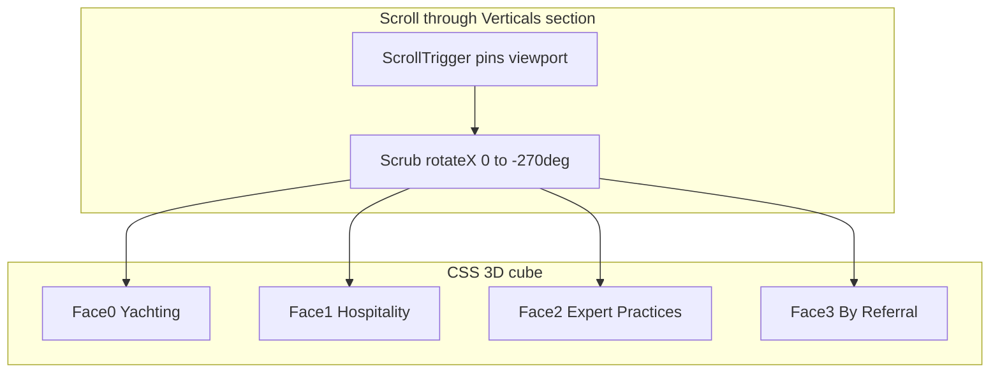

# Rolling cube for Areas of practice

## Recommendation (your choice)

Use **CSS 3D transforms + GSAP ScrollTrigger** in [`src/components/sections/verticals.tsx`](src/components/sections/verticals.tsx). Do **not** add a second Three.js object to the statue scene — text-heavy editorial UI belongs in HTML, and the site already pins/scrubs with GSAP in [`thesis.tsx`](src/components/sections/thesis.tsx) and [`hero.tsx`](src/components/sections/hero.tsx).



Four verticals map cleanly to **four 90° rolls** around the bottom edge (cube rolling upward toward the viewer).

---

## Why not Three.js here

| Concern | CSS + GSAP | Three.js cube |
|---|---|---|
| Typography (Cormorant, eyebrows, line breaks) | Native HTML/Tailwind | `drei/Html` or textures — harder to match |
| Accessibility / SEO | Full text in DOM | Often degraded |
| Performance | GPU compositing only | Extra draw calls + possible second canvas |
| Scroll wiring | Local ScrollTrigger on section | Must sync with Lenis + existing [`camera-rig.tsx`](src/components/three/camera-rig.tsx) |
| Statue scene | Unchanged | Competes visually with brand statue |

The fixed statue canvas stays as-is; camera keyframe 2 already holds on the face/head during the Verticals scroll segment.

---

## Architecture

### 1. Extract face content into a small presentational component

Keep the existing `verticals` data array and card markup (header + Website / Cinematic AI / Automation + outcome). Extract to something like `VerticalFace` inside the same file (or `vertical-face.tsx` if it grows):

```tsx
function VerticalFace({ v }: { v: Vertical }) {
  // Same structure as current motion.article inner content
}
```

This avoids duplicating the four copy blocks you already defined.

### 2. CSS 3D cube structure

Replace the `grid grid-cols-2` with:

```tsx
<section ref={sectionRef} id="verticals" className="relative">
  {/* eyebrow stays outside pin, fades in on enter */}
  <div ref={pinRef} className="h-svh overflow-hidden">
    <div className="flex h-full items-center justify-center perspective-[1200px]">
      <div ref={cubeRef} className="relative size-[min(88vw,420px)] preserve-3d">
        {verticals.map((v, i) => (
          <div key={v.index} className="absolute inset-0 backface-hidden border ..." style={FACE_TRANSFORMS[i]}>
            <VerticalFace v={v} />
          </div>
        ))}
      </div>
    </div>
  </div>
</section>
```

Face transforms (cube rolling on **X axis**, size = `--cube`):

| Face index | Vertical | Transform |
|---|---|---|
| 0 | Yachting | `rotateX(0deg) translateZ(calc(var(--cube)/2))` |
| 1 | Hospitality | `rotateX(90deg) translateZ(calc(var(--cube)/2))` |
| 2 | Expert Practices | `rotateX(180deg) translateZ(calc(var(--cube)/2))` |
| 3 | By Referral | `rotateX(270deg) translateZ(calc(var(--cube)/2))` |

Parent cube rotation (scrubbed): `rotateX(0deg → -270deg)` — each −90° brings the next face forward.

Add utilities in [`globals.css`](src/app/globals.css) if needed:

```css
@utility preserve-3d { transform-style: preserve-3d; }
@utility backface-hidden { backface-visibility: hidden; }
```

Faces get a semi-opaque dark panel (`bg-marine/85` or `bg-marine/90` + `border-bone/10`) so text stays readable over the video background (same issue as Thesis).

### 3. GSAP ScrollTrigger (mirror Thesis pattern)

In `Verticals`, swap `useInView` + stagger for `useGSAP` + pin/scrub:

```tsx
useGSAP(() => {
  if (!sectionRef.current || !pinRef.current || !cubeRef.current) return;

  gsap.timeline({
    scrollTrigger: {
      trigger: sectionRef.current,
      start: "top top",
      end: "+=320%",        // ~80% viewport scroll per face (tunable)
      pin: pinRef.current,
      scrub: 1,
      anticipatePin: 1,
      invalidateOnRefresh: true,
    },
  }).fromTo(
    cubeRef.current,
    { rotateX: 0 },
    { rotateX: -270, ease: "none", duration: 1, transformOrigin: "center center" },
    0,
  );
}, { scope: sectionRef });
```

**Transform origin:** For a convincing “roll over the bottom edge”, set origin to `center bottom` on the cube (or wrap cube in an outer group that translates so the bottom edge stays anchored — tune in preview).

Optional polish: add short **holds** at each 90° step using a stepped ease or timeline labels (`0`, `0.25`, `0.5`, `0.75`, `1`) so each face rests briefly before the next roll.

### 4. Eyebrow behavior

Keep `— Areas of practice / 02` fixed at the top of the pinned viewport (outside the rotating cube), fading in once on section enter — same editorial rhythm as other sections.

### 5. Mobile / reduced motion

- **Default (your choice):** Same cube on all breakpoints; cube size scales down with `min(88vw, 420px)`.
- **Fallback (optional later):** `@media (max-width: 768px)` or `prefers-reduced-motion: reduce` → disable pin and show a vertical stack of the four cards (current grid). Not in initial scope unless you want it — flag if readability suffers on small screens.

---

## Files to change

| File | Change |
|---|---|
| [`src/components/sections/verticals.tsx`](src/components/sections/verticals.tsx) | Main rewrite: cube DOM, GSAP pin/scrub, extract `VerticalFace` |
| [`src/app/globals.css`](src/app/globals.css) | Optional `preserve-3d` / `backface-hidden` utilities |
| [`src/components/three/camera-rig.tsx`](src/components/three/camera-rig.tsx) | **No change required initially** — Verticals section grows taller, which extends time on keyframe 2; tune keyframe timing only if statue framing feels off after preview |

No new dependencies. Reuse [`@/lib/gsap`](src/lib/gsap) and `@gsap/react`.

---

## Verification

1. Run dev server, scroll from Thesis into Verticals.
2. Confirm four distinct rolls: Yachting → Hospitality → Expert Practices → By Referral.
3. Check text readability on each face over bright video areas (face panel opacity may need tuning).
4. Confirm Lenis smooth scroll + pin do not jitter; refresh after resize.
5. Quick pass on mobile width for cube size and text overflow.

---

## Tuning knobs (after first preview)

- `end: "+=320%"` — scroll length per section (more = slower rolls)
- Cube size `min(88vw, 420px)` vs `max-w-md`
- `transformOrigin: "center bottom"` vs centered origin
- Face background opacity for contrast
- Stepped holds between faces
